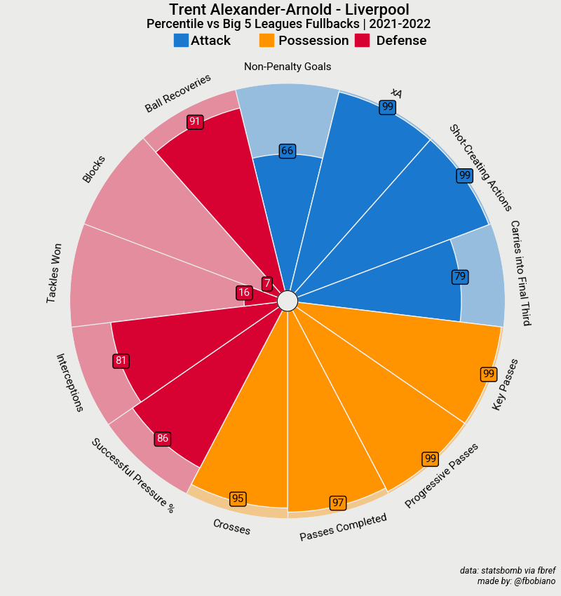
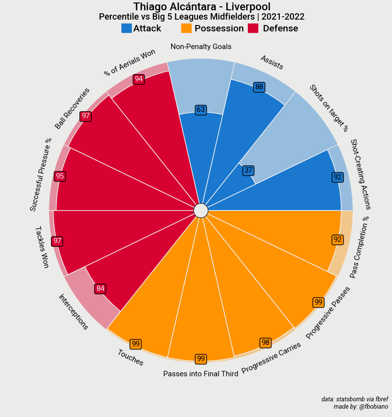
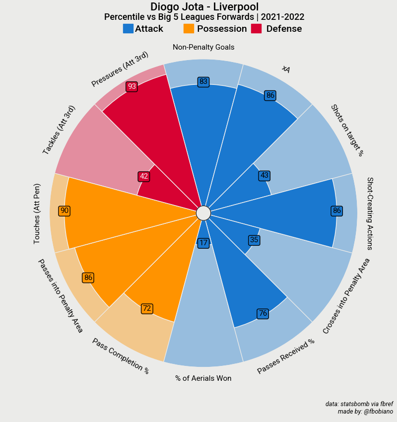

# Sports Analytics - Pizza Charts 

## Overview

This repository contains examples for generate pizza charts from **mplsoccer** automatically for players from <a href="https://fbref.com/en/">fbref</a>. The chart is made only by the full report. 

Example for url: https://fbref.com/en/players/178ae8f8/scout/11160/Diogo-Jota-Scouting-Report

## Prerequisite

Have python installed and the following packages:

    mplsoccer
    matplotlib
    requests
    pandas
    bs4

## Usage

1) First you need to obtain the url for the Complete Scouting Report of the player you want. you can choose the competition for different percentiles

2) From project root repository run the following command:

        python .\pizza_chart.py make {url}

3) The image will be save in the folder **charts**.

## Showcases

#### Chart for Matip - Big 5 Leagues - 2021/2022

#### Chart for Alexander-Arnold - Big 5 Leagues - 2021/2022

#### Chart for Thiago - Big 5 Leagues - 2021/2022

#### Chart for Diogo Jota - Big 5 Leagues - 2021/2022

### CHANGELOG

###### == 1.0.0 ==
- get player data from url
- make chart
- save chart to /charts
- readme first version